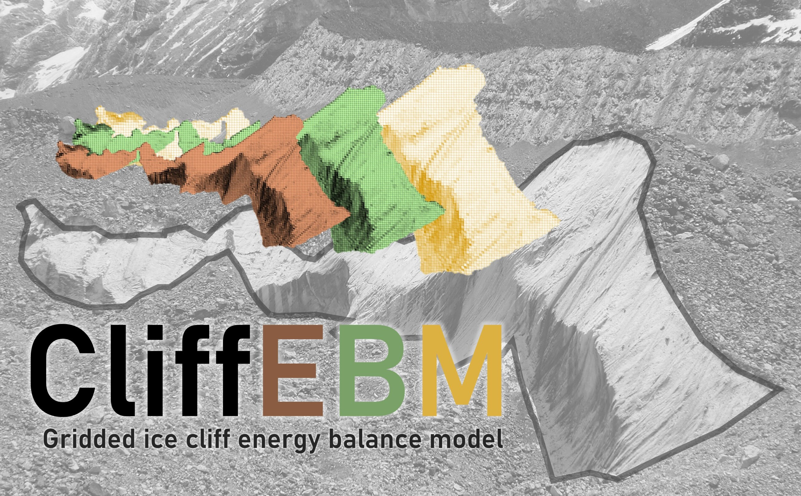
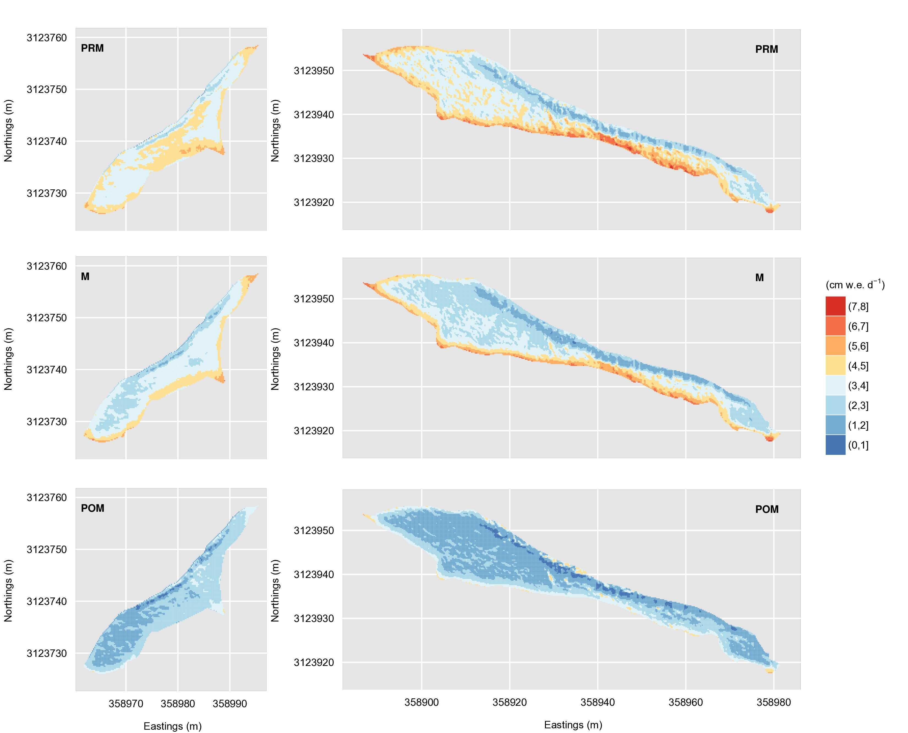

# CliffEBM
## A _Gridded Ice Cliff Energy Balance Model_
> 2023-05-21



_CliffEBM_ is a model that calculates the distributed surface energy balance for ice cliffs, i.e. steep ice surfaces with complex, heterogeneous topographies. It was originally designed for supraglacial ice cliffs on debris-covered glaciers. The model has been applied on debris-covered glaciers in the Nepalese Himalayas [(Buri et al., 2016a)](https://doi.org/10.3189/2016AoG71A059) and in Southeast Tibet [(Kneib et al., 2022)](https://doi.org/10.5194/tc-16-4701-2022).


## Working example
In this repository we provide example input data (digital elevation models, shapefiles, meteodata) to run _CliffEBM_ on one supraglacial cliff on the debris-covered Lirung Glacier (Nepal). To run the model you need to download the entire branch on your machine, and adjust the paths in the model code (CliffEBM.R, section "primary definitions") according to the paths on your machine.


|  | 
|:--:| 
| Fig. 1: *Distribution of daily melt rate (cm w.e.) for cliff 1 (left) and cliff 2 (right) for pre-monsoon (PRM), monsoon (M) and post-monsoon (POM) periods (Fig. 9 from [Buri et al., 2016a](https://doi.org/10.3189/2016AoG71A059)).* |


## Software
- [R](https://cran.r-project.org/bin/windows/base/) (R version 4.3.0 (2023-04-21 ucrt) -- "Already Tomorrow")

The model should also run on older versions.


## Packages
- [cleaRskyQuantileRegression](https://github.com/laubblatt/cleaRskyQuantileRegression/tree/master), doParallel, foreach, grDevices, iterators, methods, parallel, raster, rgdal, rgeos, sf, sp, stats, utils, zoo

Install packages
```R
install.packages("package-name")
 ```


## References
- Buri P, Pellicciotti F, Steiner JF, Miles ES and Immerzeel WW (2016a) *A grid-based model of backwasting of supraglacial ice cliffs on debris-covered glaciers*. _Annals of Glaciology_, 57(71), 199–211. https://doi.org/10.3189/2016AoG71A059

- Kneib M, Miles ES, Buri P, Fugger S, McCarthy MJ, Shaw TE and Pellicciotti F (2022) *Sub-seasonal variability of supraglacial ice cliff melt rates and associated processes from time-lapse photogrammetry*. _The Cryosphere_, 16, 4701–4725. https://doi.org/10.5194/tc-16-4701-2022
